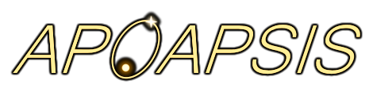

[](LICENSE)
[](https://github.com/RedReaper420/apoapsis/releases)
[](https://redreaper420.github.io/apoapsis/)

# Apoapsis

<p align="center">
  
</p>

Apoapsis is an interactive web-based star and planetary system generator inspired by Vector-Graphics' [Periapsis](https://github.com/Vector-Graphics/periapsis).

Live demo: https://redreaper420.github.io/apoapsis/

## Screenshots

||||
|-|-|-|
||||

## Features

- **Astrophysics-faithful** seeded procedural generation of main-sequence stars and planets (from tiny moons to brown dwarfs).
- Configurable generation parameters (star properties, planetary migration simulation regimes, etc.)
- Interactive 2D top-down visualization with time warp.
- Detailed body properties inspector.
- Scriptable generation filter.
- Saving & loading of systems and settings in JSON files.
- Saving total system report into a HTML document.

## Getting Started

### Online
Just open the [live demo](https://redreaper420.github.io/apoapsis/).

### Local / Self-hosting
1. Clone or download the repository (or a release).
2. Serve the files with any static HTTP server. Examples:

**Python 3**
```bash
python -m http.server 8000
```

**Node.js (npx)**
```bash
npx serve .
```

3. In a modern browser, open the URL leading to `index.html` at your server (i.e., `http://localhost:8000` with Python server).

> [!TIP]
> When hosting on your own server you can change the "Home" button destination by editing `home_url.txt`.

## Quick Usage

|Action|How|
|---|---|
|Generate a new system|Click `♻️ Generate` at the top|
|Change seed / settings|Click `⚙️` at the top and navigate the opened settings overlay|
|Inspect a body|Click it in the view or use the navigation panel at the left|
|Toggle details rendering|Click buttons at the bottom (`🌗` `💡` `🧲` `☁️` `🌐` `🌱` `🔆` `🔄` `🔍` `🏷️` `💫` `👁️`)|
|Time warp|Click `▶️`/`⏸️` to toggle pause; drag the slider at the bottom to control simulation speed|
|Save / load system|Click `💾` / `📂` at the top|
|Export HTML report|Click `📄` at the top|
|Activate generation filters|1. Open the settings (`⚙️`) <br> 2. Open the `Filter` tab <br> 3. Select, paste, or type a script in the text box(es) (⚠️ only paste code you trust) <br> 4. Click on `Enable filter`|

## License & Credits

Inspired by [Periapsis](https://github.com/Vector-Graphics/periapsis) by VectorV Jay Walker ([@Vector-Graphics](https://github.com/Vector-Graphics)).

This project is licensed under the [MIT License](LICENSE).  

For third-party libraries, assets, and attributions, see [THIRD_PARTY_LICENSES.md](THIRD_PARTY_LICENSES.md).
